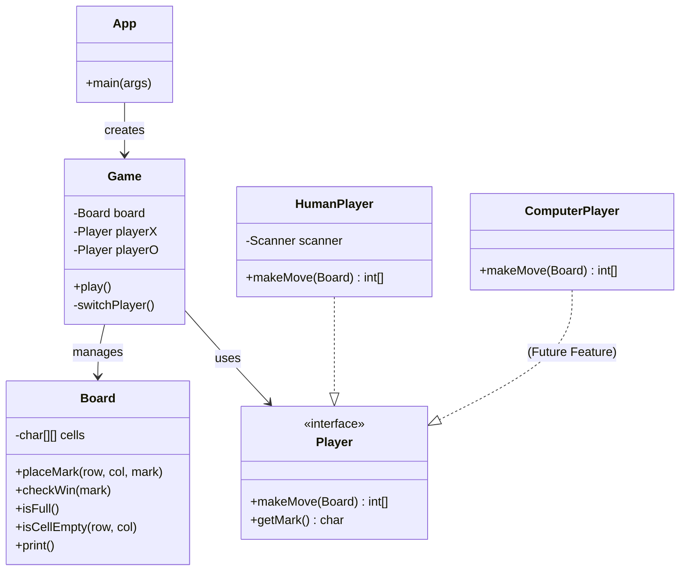

# Architektur

Die Architektur folgt einem einfachen Schichtenmodell, wobei die **Domain Logic** (Board, Game) strikt von der **User Interface** Logik (Main, Scanner) getrennt ist. Interfaces wie `Player` ermöglichen eine leichte Erweiterbarkeit (z.B. AI Gegner) und vereinfachen das Testing durch Mocks.

## Klassendiagramm

## Komponenten
- **App**: Einstiegspunkt. Injeziert Abhängigkeiten (Players, Board) in das Game.
- **Game**: Steuert den Spielablauf (Game Loop, Auswertung von Sieg/Niederlage).
- **Board**: Hält den State des Spielfelds und validiert Logik (Siegbedingungen).
- **Player**: Abstraktion für Spielerzüge.
